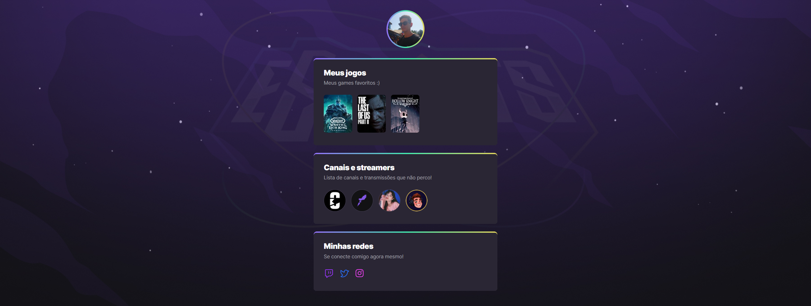

# NLW eSports

>Trilha Explorer

Projeto construído no evento Next Level Week da Rocketseat

[Clique aqui para acessar](https://lofrani.github.io/nlw-esports-explorer)

## 💻 Tecnologias
- HTML
- CSS
- Git e Github

## 📓 O que aprendi
Foi uma semana produtiva e cheia de novos conteúdos. Aprendi a usar e estruturar textos, imagens e links no HTML e manipular e usar seletores e atributos no CSS com mais clareza e organização.

Concact me :)
lofrani.joao@hotmail.com